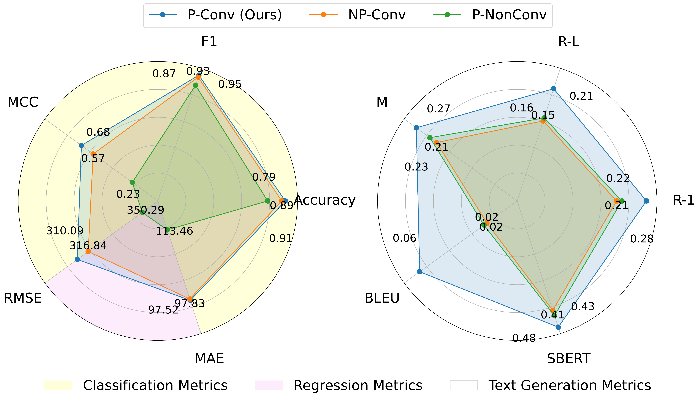

# PERSONA Benchmark 
<div style="margin-top: 8px; font-family: Consolas, monospace; font-size: 16px;" align="center">

*A Personalized Conversational Benchmark: Towards Simulating Personalized Conversations*
<p align="center">
  <a href="https://arxiv.org/abs/2505.14106" target="_blank">
    
  </a><br>
  <sub><code>Click the logo to read our paper on arXiv</code></sub>
</p>

</div>
<p align="center">
  <!-- ⭐ Stars badge -->
  
  <!-- 📄 License badge -->
  
  <!-- 🔖 ArXiv -->
  <a href="https://arxiv.org/abs/2505.14106"></a>
</p>

> **PERSONA Benchmark** (<strong>PᴇʀꜱᴏɴᴀCᴏɴᴠBᴇɴᴄʜ</strong>) is the **first large-scale benchmark** that **integrates personalization and multi-turn conversation**.

<p align="center">
  <table>
    <tr>
      <td align="center">
        <br>
        <sub><code>In-context prompt construction for personalized conversational inference</code></sub>
      </td>
      <td align="center">
        <br>
        <sub><code>Performance of GPT-4.1 on PERSONA benchmark</code></sub>
      </td>
    </tr>
  </table>
</p>


---

## 🚀 Recent News
* 🗓️**2025-05-20**  Initial code and dataset released
* 🗓️**2025-05-23**  Our preprint <a href="https://arxiv.org/abs/2505.14106">arXiv paper</a> released  

---

## 📖 Table of Contents
1. [Why PERSONA Benchmark?](#why-persona-benchmark)
2. [Key Features](#key-features)
3. [Installation](#installation)
4. [Quick Start](#quick-start)
5. [Dataset](#dataset)
6. [Tested Models](#tested-models)
7. [Results](#results)
8. [Project Structure](#project-structure)
9. [Citation](#citation)
10. [Contact](#contact)

---

## Why PERSONA Benchmark?
Traditional personalization datasets ignore dialogue structure, while classic multi-turn benchmarks treat users as anonymous. <strong>PᴇʀꜱᴏɴᴀCᴏɴᴠBᴇɴᴄʜ</strong> bridges this gap:

* **Personalized and Conversational** – Each task conditions on both the evolving thread and the author’s history.  
* **Realistic Scale** – 19 k posts, 111 k conversations, 3 800 + users across 10 domains.  
* **Three Task Families** – Classification, regression, and generation allow holistic evaluation.  
* **Strong Baselines** – GPT‑4.1, Claude‑3.5, LLaMA‑3, DeepSeek-R1 etc.

---

## Key Features
| 🌟 Feature | Description |
|-----------|-------------|
| **P‑Conv / P‑NonConv / NP‑Conv** | Isolate the benefit of personalization and conversation structure |
| **Domain Diversity** | 10 Reddit domains from *worldnews* to *gaming* |
| **Unified Prompting Pipeline** | Few‑shot templates for zero‑shot evaluation |
| **Open-Source & Reproducible** | MIT-licensed code, Hugging Face mirror, one-command demo |

---

## Installation
### 1 · Create conda environment
```bash
conda create -n persona-bench python=3.10 -y
conda activate persona-bench
conda install -c conda-forge git git-lfs -y
```

### 2 · Install dependencies
```bash
python -m pip install --upgrade pip
pip install -r requirements.txt
```


### 3 · Download the Dataset

You can obtain <strong>PᴇʀꜱᴏɴᴀCᴏɴᴠBᴇɴᴄʜ</strong> with either of the methods below.  
**Method A (Google Drive) is recommended** because it ships the exact splits used in our experiments.

#### A. Google Drive — ready‑to‑use release (**recommended**)
click <a href='https://drive.google.com/file/d/1d8Ju2t0Aa_Nqi5r_cybjvHudYamAN9NX/view?usp=share_link'>google cloud</a> to directly download our processed dataset
```bash
# 1) Download the required file
Please download the file 'persona_bench_release.zip' from the following link:
https://drive.google.com/file/d/1d8Ju2t0Aa_Nqi5r_cybjvHudYamAN9NX/view?usp=share_link
After downloading, please move this file into a 'data/PERSONA_Bench/' directory relative to where you will run the subsequent commands.
# For example, if you are in your project's root directory, you would save it as:
# [Your Project Root]/data/PERSONA_Bench/merged_posts_remapped.json
# 2) Create the target directory (if you haven't manually created it for the download)
mkdir -p data/PERSONA_Bench
# 3) Verify the downloaded file is in the correct location
Ensure 'merged_posts_remapped.json' is located at 'data/PERSONA_Bench/merged_posts_remapped.json'
```

```bash
# (Optional) If users still want to use gdown after being shown the link,
# You can include this as an alternative:
# Alternative using gdown (if you have it installed):
python -m pip install --upgrade gdown  # Install gdown if not already installed
mkdir -p data/PERSONA_Bench
gdown --id 1d8Ju2t0Aa_Nqi5r_cybjvHudYamAN9NX -O data/PERSONA_Bench/merged_posts_remapped.json
```

The archive already contains the **processed** train / dev / test splits, so **no further steps are required**.

---

#### B. Hugging Face — raw records (requires preprocessing)
```bash
# Install Git LFS for large‑file support
git lfs install

# Clone the official dataset repository
git clone https://huggingface.co/datasets/PERSONABench/PERSONA-Bench               data/Raw_Data_Postized.json
```

Next, convert the raw JSON files to the canonical format with  
[`Raw_Data_Process.py`](./Raw_Data_Process.py):
The script writes the processed dataset to `data/PERSONA_Bench/`, resulting in the same directory structure as Method A.

---

## Quick Start

### 1&nbsp;·&nbsp;Demo-level evaluation (quick sanity check)

```bash
# ── Sentiment classification ───────────────────────────────────────────────
python demo/3.1PromptMaker.py    # 👈 first open the script and fill in your API key
python demo/GPT3.1.py            #    also adjust INPUT_JSON_FILE if you moved the data

# ── Regression ────────────────────────────────────────────────────────────
python demo/3.2PromptMaker.py    # same edits as above
python demo/GPT3.2.py

# ── Generation ────────────────────────────────────────────────────────────
python demo/3.3PromptMaker.py
python demo/GPT3.3.py
```

> ⚠️ **API credentials needed**  
> Each `demo/GPT*.py` script expects an API key (e.g., `OPENAI_API_KEY`, `ANTHROPIC_API_KEY`).  
> Edit the file **or** export the key in your shell before running.

---

### 2&nbsp;·&nbsp;Full-scale evaluation with the official pipeline  

Below we use **PromptMakers/3.3PromptMaker.py** and **LLMEvaluators/3.3/GPT4.1.py**.  
Adopt the same pattern for other tasks / models.

```bash
# ① Prepare prompts
python PromptMakers/3.3PromptMaker.py \
    --input_json_file data/splits/generation_test.jsonl      # 👈 change to your path

# ② Run the LLM
python LLMEvaluators/3.3/GPT4.1.py \
    --input_json_file outputs/prompt_3.3_generation.jsonl \  # 👈 result of step ①
    --output_jsonl_file outputs/gpt4.1_generation.jsonl      # 👈 where to save generations
```

**Required edits**

| File | What to change |
|------|----------------|
| *PromptMakers/3.3PromptMaker.py* | `INPUT_JSON_FILE` → point to the dataset split you want |
| *LLMEvaluators/3.3/GPT4.1.py*    | `INPUT_JSON_FILE` / `OUTPUT_JSONL_FILE` → prompt file from step ① & save-path |
| *LLMEvaluators/3.3/GPT4.1.py*    | API key / base URL section at the top |

---

### 3&nbsp;·&nbsp;Post-hoc metric computation  

If you evaluate **DeepSeek** or **Llama** models with the log-only workflow, run the log-level evaluator:

```bash
python LLMEvaluators/LogEvaluator/LogEval3.3.py \
    --input_jsonl_file PATH_TO_YOUR_JSONL   # 👈 also update inside the script
```

Open *LogEvaluator* and update `INPUT_JSONL_FILE` (plus any other paths) before running.

---

**Tip:** add the project root to `PYTHONPATH` or run every command from the repo root so that all relative imports resolve correctly.

---

## Dataset
| Field | Value |
|-------|-------|
| **Name** | <strong>PᴇʀꜱᴏɴᴀCᴏɴᴠBᴇɴᴄʜ</strong> |
| **Size** | 19 215 posts · 111 239 conversations · 3 878 users |
| **Domains** | [See at table](#table1) |
| **License** | Research‑only (Reddit TOS) |

<br>

<table id='table1'>
  <thead>
    <tr>
      <th>Domain</th>
      <th>Style</th>
      <th>Conversational Engagement</th>
      <th>Conversation Purpose</th>
      <th>User Interactivity</th>
    </tr>
  </thead>
  <tbody>
    <tr>
      <td>Worldnews</td>
      <td rowspan="4">Formal</td>
      <td>Debate-Driven</td>
      <td>Education</td>
      <td>Low</td>
    </tr>
    <tr>
      <td>Science</td>
      <td>Debate-Driven</td>
      <td>Education</td>
      <td>Medium</td>
    </tr>
    <tr>
      <td>Politics</td>
      <td>Debate-Driven</td>
      <td>Education</td>
      <td>Low</td>
    </tr>
    <tr>
      <td>Technology</td>
      <td>Information Sharing</td>
      <td>Education</td>
      <td>Medium</td>
    </tr>
    <tr>
      <td>Gaming</td>
      <td rowspan="4">Casual</td>
      <td>Community-Based</td>
      <td>Entertainment</td>
      <td>High</td>
    </tr>
    <tr>
      <td>Life</td>
      <td>Community-Based</td>
      <td>Socializing</td>
      <td>Medium</td>
    </tr>
    <tr>
      <td>Movies</td>
      <td>Opinion-Based</td>
      <td>Entertainment</td>
      <td>Medium</td>
    </tr>
    <tr>
      <td>Books</td>
      <td>Opinion-Based</td>
      <td>Entertainment</td>
      <td>High</td>
    </tr>
    <tr>
      <td>Entrepreneur</td>
      <td>Motivational</td>
      <td>Supportive</td>
      <td>Advice/Support</td>
      <td>High</td>
    </tr>
    <tr>
      <td>Art</td>
      <td>Creative</td>
      <td>Community-Based</td>
      <td>Entertainment</td>
      <td>Medium</td>
    </tr>
  </tbody>
</table>


---

## Tested Models
## Tested Models
| Model | Year | Type |
|-------|------|------|
| GPT-4.1 | 2025 | Commercial |
| GPT-4o-mini | 2024 | Commercial |
| GPT-4o | 2024 | Commercial |
| GPT-4.1-mini | 2025 | Commercial |
| Claude-3.5 Sonnet | 2024 | Commercial |
| Gemini 2.5 Pro | 2025 | Commercial |
| LLaMA-3 80B-Instruct | 2024 | OSS |
| DeepSeek-R1 | 2025 | OSS |
| DeepSeek-V3 | 2025 | OSS |
| Mistral| 2024 | OSS |
| o3 | 2025 | Commercial |
| o4-mini | 2025 | Commercial |
---

## Results
<div style="overflow-x:auto">
<table class="metrics-table">
  <thead>
    <tr>
      <th rowspan="2">Task</th>
      <th rowspan="2">Metric</th>
      <th colspan="5">Performance&nbsp;Metrics</th>
    </tr>
    <tr>
      <th>GPT-4.1</th><th>GPT-4o-mini</th><th>Claude-3.5</th><th>LLaMA3-3</th><th>DeepSeek-R1</th>
    </tr>
    <tr>
      <th colspan="2"></th>
      <th colspan="5" style="font-size:0.8em;font-weight:400;">
        (<span class="pconv">P-Conv&nbsp;(Ours)</span>&nbsp;|&nbsp;<span class="nonconv">P-NonConv</span>)
      </th>
    </tr>
  </thead>
  <tbody>
    <!-- Sentiment Classification -->
    <tr>
      <td class="task-cell" rowspan="3">Sentiment&nbsp;<br>Classification</td>
      <td class="metric-name">Accuracy <span class="arrow-up"></span></td>
      <td><span class="pconv">0.9122</span>&nbsp;|&nbsp;<span class="nonconv">0.7862</span></td>
      <td><span class="pconv">0.6875</span>&nbsp;|&nbsp;<span class="nonconv">0.6562</span></td>
      <td><span class="pconv">0.9109</span>&nbsp;|&nbsp;<span class="nonconv">0.8192</span></td>
      <td><span class="pconv">0.8458</span>&nbsp;|&nbsp;<span class="nonconv">0.7305</span></td>
      <td><span class="pconv">0.8853</span>&nbsp;|&nbsp;<span class="nonconv">0.7092</span></td>
    </tr>
    <tr>
      <td class="metric-name">F1 <span class="arrow-up"></span></td>
      <td><span class="pconv">0.9481</span>&nbsp;|&nbsp;<span class="nonconv">0.8720</span></td>
      <td><span class="pconv">0.7895</span>&nbsp;|&nbsp;<span class="nonconv">0.7640</span></td>
      <td><span class="pconv">0.9474</span>&nbsp;|&nbsp;<span class="nonconv">0.8908</span></td>
      <td><span class="pconv">0.8401</span>&nbsp;|&nbsp;<span class="nonconv">0.7495</span></td>
      <td><span class="pconv">0.8848</span>&nbsp;|&nbsp;<span class="nonconv">0.7362</span></td>
    </tr>
    <tr>
      <td class="metric-name">MCC <span class="arrow-up"></span></td>
      <td><span class="pconv">0.6770</span>&nbsp;|&nbsp;<span class="nonconv">0.2266</span></td>
      <td><span class="pconv">0.2268</span>&nbsp;|&nbsp;<span class="nonconv">0.1870</span></td>
      <td><span class="pconv">0.6721</span>&nbsp;|&nbsp;<span class="nonconv">0.3666</span></td>
      <td><span class="pconv">0.4420</span>&nbsp;|&nbsp;<span class="nonconv">0.2333</span></td>
      <td><span class="pconv">0.6070</span>&nbsp;|&nbsp;<span class="nonconv">0.2586</span></td>
    </tr>
    <tr>
      <td class="task-cell" rowspan="2">Impact&nbsp;<br>Forecasting</td>
      <td class="metric-name">RMSE <span class="arrow-down"></span></td>
      <td><span class="pconv">310.09</span>&nbsp;|&nbsp;<span class="nonconv">350.29</span></td>
      <td><span class="pconv">310.23</span>&nbsp;|&nbsp;<span class="nonconv">351.50</span></td>
      <td><span class="pconv">282.48</span>&nbsp;|&nbsp;<span class="nonconv">344.75</span></td>
      <td><span class="pconv">319.83</span>&nbsp;|&nbsp;<span class="nonconv">350.43</span></td>
      <td><span class="pconv">300.03</span>&nbsp;|&nbsp;<span class="nonconv">353.80</span></td>
    </tr>
    <tr>
      <td class="metric-name">MAE <span class="arrow-down"></span></td>
      <td><span class="pconv">97.52</span>&nbsp;|&nbsp;<span class="nonconv">113.46</span></td>
      <td><span class="pconv">97.64</span>&nbsp;|&nbsp;<span class="nonconv">115.80</span></td>
      <td><span class="pconv">85.39</span>&nbsp;|&nbsp;<span class="nonconv">109.27</span></td>
      <td><span class="pconv">101.25</span>&nbsp;|&nbsp;<span class="nonconv">113.18</span></td>
      <td><span class="pconv">89.59</span>&nbsp;|&nbsp;<span class="nonconv">112.52</span></td>
    </tr>
    <tr>
      <td class="task-cell" rowspan="5">Next-Text&nbsp;<br>Generation</td>
      <td class="metric-name">ROUGE-1 <span class="arrow-up"></span></td>
      <td><span class="pconv">0.2777</span>&nbsp;|&nbsp;<span class="nonconv">0.2248</span></td>
      <td><span class="pconv">0.2491</span>&nbsp;|&nbsp;<span class="nonconv">0.2121</span></td>
      <td><span class="pconv">0.2161</span>&nbsp;|&nbsp;<span class="nonconv">0.1645</span></td>
      <td><span class="pconv">0.2055</span>&nbsp;|&nbsp;<span class="nonconv">0.1540</span></td>
      <td><span class="pconv">0.1786</span>&nbsp;|&nbsp;<span class="nonconv">0.1359</span></td>
    </tr>
    <tr>
      <td class="metric-name">ROUGE-L <span class="arrow-up"></span></td>
      <td><span class="pconv">0.2115</span>&nbsp;|&nbsp;<span class="nonconv">0.1565</span></td>
      <td><span class="pconv">0.1906</span>&nbsp;|&nbsp;<span class="nonconv">0.1470</span></td>
      <td><span class="pconv">0.1719</span>&nbsp;|&nbsp;<span class="nonconv">0.1130</span></td>
      <td><span class="pconv">0.1572</span>&nbsp;|&nbsp;<span class="nonconv">0.1009</span></td>
      <td><span class="pconv">0.1395</span>&nbsp;|&nbsp;<span class="nonconv">0.0911</span></td>
    </tr>
    <tr>
      <td class="metric-name">METEOR <span class="arrow-up"></span></td>
      <td><span class="pconv">0.2677</span>&nbsp;|&nbsp;<span class="nonconv">0.2316</span></td>
      <td><span class="pconv">0.2120</span>&nbsp;|&nbsp;<span class="nonconv">0.2198</span></td>
      <td><span class="pconv">0.1913</span>&nbsp;|&nbsp;<span class="nonconv">0.1636</span></td>
      <td><span class="pconv">0.1838</span>&nbsp;|&nbsp;<span class="nonconv">0.1659</span></td>
      <td><span class="pconv">0.1649</span>&nbsp;|&nbsp;<span class="nonconv">0.1401</span></td>
    </tr>
    <tr>
      <td class="metric-name">BLEU <span class="arrow-up"></span></td>
      <td><span class="pconv">0.0604</span>&nbsp;|&nbsp;<span class="nonconv">0.0206</span></td>
      <td><span class="pconv">0.0330</span>&nbsp;|&nbsp;<span class="nonconv">0.0170</span></td>
      <td><span class="pconv">0.0549</span>&nbsp;|&nbsp;<span class="nonconv">0.0123</span></td>
      <td><span class="pconv">0.0480</span>&nbsp;|&nbsp;<span class="nonconv">0.0089</span></td>
      <td><span class="pconv">0.0423</span>&nbsp;|&nbsp;<span class="nonconv">0.0083</span></td>
    </tr>
    <tr>
      <td class="metric-name">SBERT <span class="arrow-up"></span></td>
      <td><span class="pconv">0.4757</span>&nbsp;|&nbsp;<span class="nonconv">0.4322</span></td>
      <td><span class="pconv">0.4381</span>&nbsp;|&nbsp;<span class="nonconv">0.3982</span></td>
      <td><span class="pconv">0.3942</span>&nbsp;|&nbsp;<span class="nonconv">0.3512</span></td>
      <td><span class="pconv">0.3733</span>&nbsp;|&nbsp;<span class="nonconv">0.3339</span></td>
      <td><span class="pconv">0.3699</span>&nbsp;|&nbsp;<span class="nonconv">0.3307</span></td>
    </tr>
  </tbody>
</table>
</div> 

---

## Project Structure
```
├─ demo/
├─ LLMEvaluators/
├─ PromptMakers/
├─ data/
├─ config/
├─ requirements.txt
├─ Raw_Data_Process.py
└─ README.md
```

---

## Citation
<div style="margin-top: 8px; font-family: Consolas, monospace; font-size: 16px;">
Thank you for your interest in our work!
</div>

```bibtex
@misc{li2025personalizedconversationalbenchmarksimulating,
  title={A Personalized Conversational Benchmark: Towards Simulating Personalized Conversations},
  author={Li Li and Peilin Cai and Ryan A. Rossi and Franck Dernoncourt and Branislav Kveton and Junda Wu and Tong Yu and Linxin Song and Tiankai Yang and Yuehan Qin and Nesreen K. Ahmed and Samyadeep Basu and Subhojyoti Mukherjee and Ruiyi Zhang and Zhengmian Hu and Bo Ni and Yuxiao Zhou and Zichao Wang and Yue Huang and Yu Wang and Xiangliang Zhang and Philip S. Yu and Xiyang Hu and Yue Zhao},
  year={2025},
  eprint={2505.14106},
  archivePrefix={arXiv},
  primaryClass={cs.CL},
  url={https://arxiv.org/abs/2505.14106}
}
```
---

## Contact
Feel free to <a href='https://github.com/PERSONA-bench/PERSONA/issues'>make an issue</a> or send me <a href='karamazovaniki@gmail.com'>email</a>
